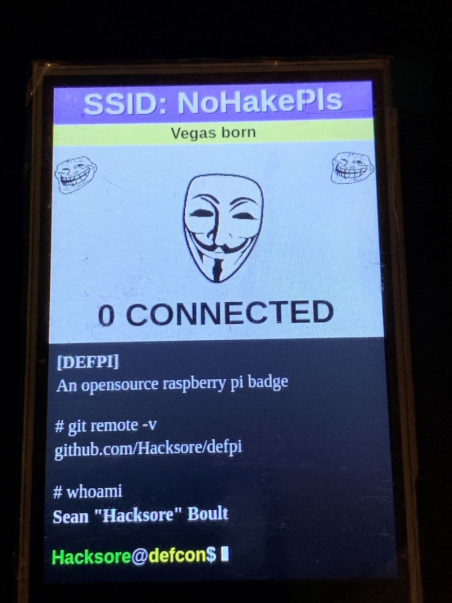
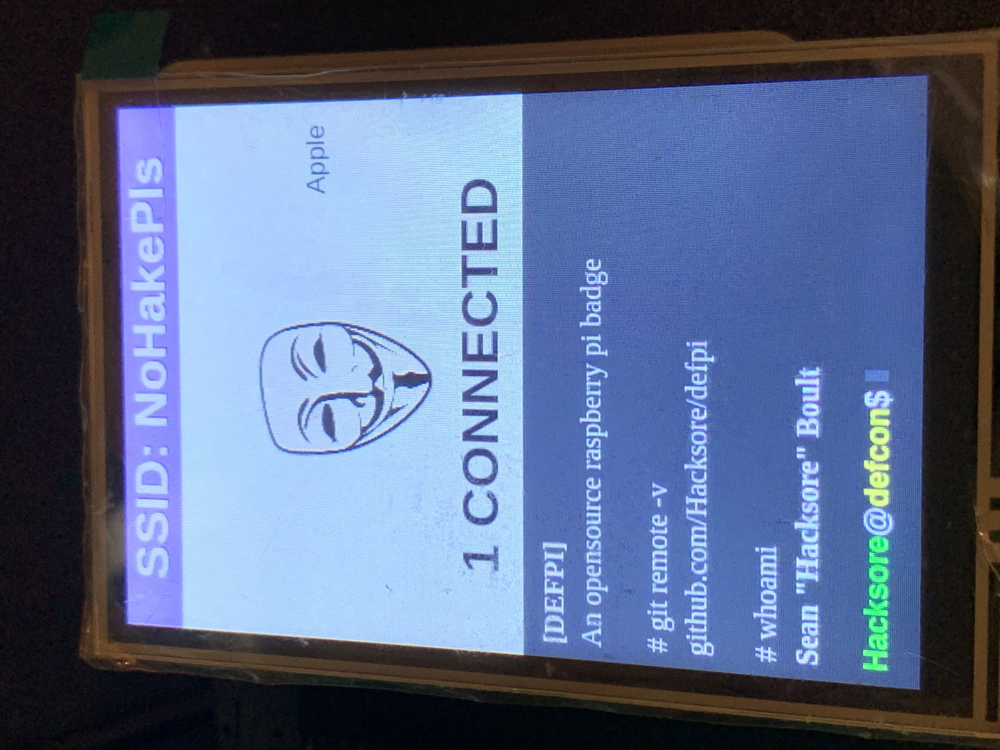

# defpi
A silly badge for defcon 2019 built for a Raspberry PI

# Hardware
|                                  |                  |
| --------------------------       | -------------    |
| Raspberry PI 3 A+                | Brains           |
| VMP400/ILI9486                   | 3.5" display     |
| Anker PowerCore II Slim 10000    | Power            |

# Software
|                           |                                                               |
| --------------------------| -----------------------------------                           |
| Chromuium Browser         | Placed in kiosk mode and displays the webapp                  |
| Node/Express              | Running the local server for rest calls and static serving    |
| React                     | Front end webapp framework                                    |
| hostapd                   | Making the RPI an access point                                |
| arp-scan                  | Scanning the LAN for connected clients                        |

# Pics

